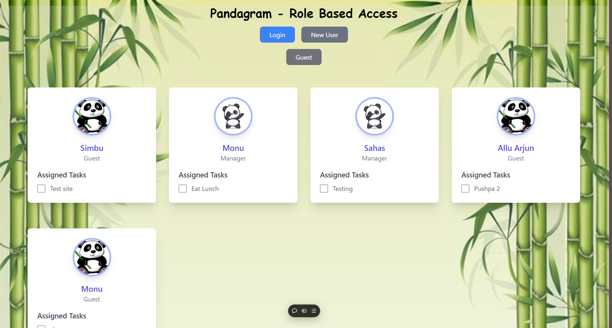
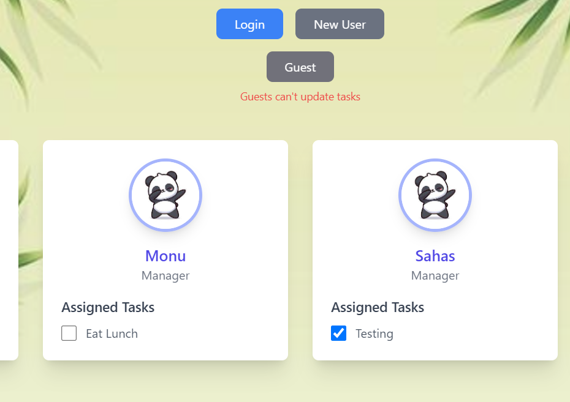

# Pandagram - Role-Based-Access

Pandagram is a simple React application that demonstrates role-based access control (RBAC) for user management. Users can log in, view tasks, and manage roles and tasks based on their access level (Admin, Manager, or Guest). The project utilizes React state, local storage for persistent data, and role-based UI rendering for a dynamic user experience.

# Demo Video
https://github.com/user-attachments/assets/2f7a8607-9b9e-41ba-a0d3-2fc3ab5c2841

# Features

User Roles:

Admin: Can manage roles, add new users, and assign tasks.
Manager: Can view tasks and delete them.
Guest: Can only view with no editing permissions.
Persistent Data: All user information is stored in the local storage, ensuring data persists even after page reloads.

Task Management: Admins and Managers can view assigned tasks. Admins have the ability to add or remove tasks.

Login System: Users can log in to the application and access role-specific features.

## Setup and Installation

To get started with this project locally, follow the steps below:

## 1. Clone the Repository

Clone the repository to your local machine using the following command:
git clone https://github.com/Monu2114/Role-Based-Access.git

## 2. Navigate to the Frontend Folder
Change into the frontend directory: 
cd frontend

## 3. Install Dependencies :
   npm install

## 4. Start the Development Server
   npm run
This will start the application, and you can view it in your browser by navigating to http://localhost:5173.

# Screenshots

Add Multiple tasks by seperating with comma(',')

Guests can't update roles and change tasks :

Only Admins can update the roles of users :

For other features, do watch the demo video

